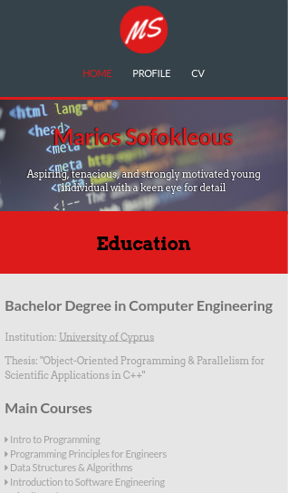
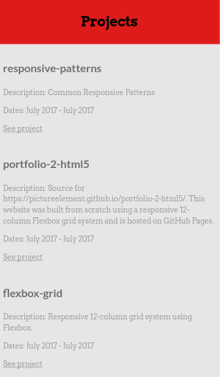
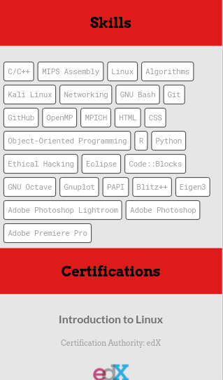
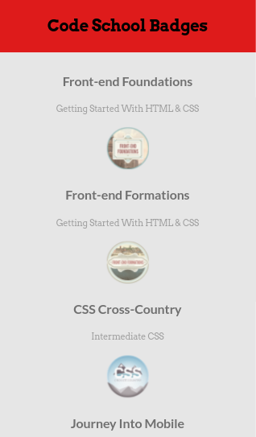
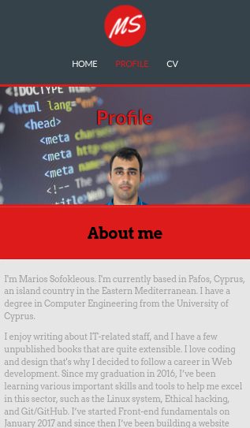
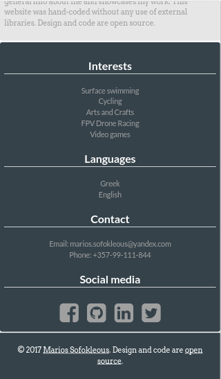

## About

This website is a portfolio site whrere I showcase stuff I've
done/built/designed. This site also serves as a web resume where I present my
background and skills.

The site is adaptive and responsive. It was built from scratch using a custom
12-column Flexbox grid system.

The site lives here: https://pictureelement.github.io/portfolio-2-html5/

## Page Samples

## License

&copy; 2017 Marios Sofokleous

Licensed under the [MIT License](LICENSE)

Feel free to inspect the code structure, and reuse what is appropriate. But
please respect that the files in the following directories have their own
copyright information:

 1. images/
 2. docs/images

You may not reuse the following files without my written permission:

1. images/id.png
2. images/logomakr_6AGIbQ.png
3. images/logomakr_9wlKJX.png
4. docs/images/id.png
5. docs/images/logomakr_6AGIbQ.png
6. docs/images/logomakr_9wlKJX.png
